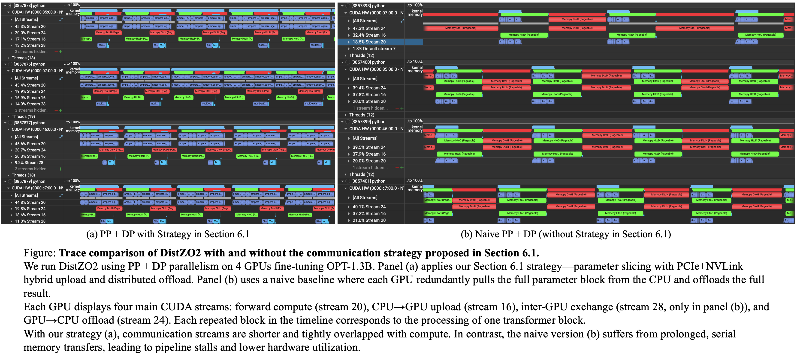
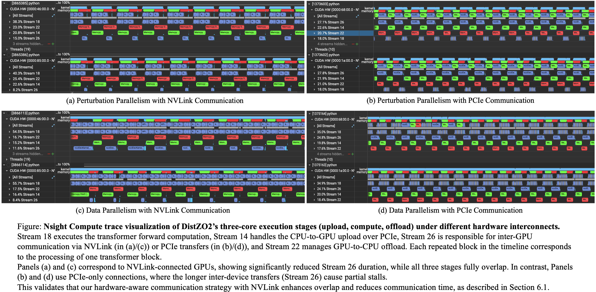
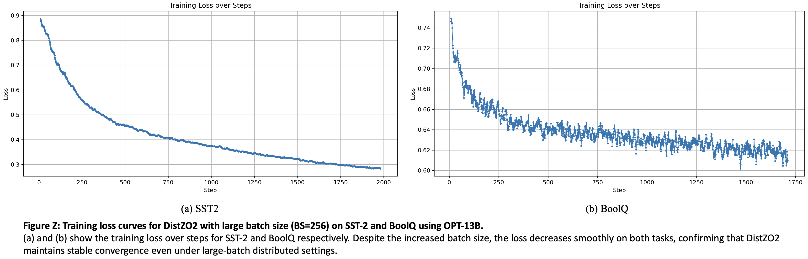

# distzo2paper

## Nsight-based Runtime Trace Analysis

We conduct four sets of Nsight-based runtime trace analyses to evaluate the effectiveness of our communication strategy and parallelization design.

---

### Experiment 1: With vs. Without Section 6.1 Strategy

**Figure 1**: Trace comparison of DistZO2 with and without the communication strategy proposed in Section 6.1.  
We run DistZO2 using PP + DP parallelism on 4 GPUs while fine-tuning OPT-1.3B. Panel (a) applies our Section 6.1 strategy—parameter slicing with PCIe+NVLink hybrid upload and distributed offload. Panel (b) uses a naive baseline where each GPU redundantly pulls and pushes the full parameter block via PCIe.  
Each row shows four key CUDA streams per GPU: forward compute (blue), CPU→GPU upload (red), inter-GPU slice exchange (green), and GPU→CPU offload (cyan). **Each repeated block in the timeline corresponds to the processing of one transformer block.**

#### Observations:
- With our strategy (panel a), memory streams are shorter and tightly overlapped with compute.
- Without the strategy (panel b), memory transfers (especially upload and offload) are prolonged and serialized.
- Overlap between communication and compute is significantly reduced in the naive version, resulting in under-utilized GPUs.

#### Conclusion:
The Section 6.1 communication strategy reduces PCIe pressure and restores pipeline overlap via parameter slicing and NVLink peer exchange, enabling high-throughput fine-tuning with minimal stalls.

---

### Experiment 2: NVLink vs. PCIe Interconnect

**Figure 2**: Nsight trace visualization of DistZO2’s communication and computation pipeline under different interconnect settings.  
We compare Perturbation Parallelism (PP) and Distributed Data Parallelism (DP) under NVLink (left column) versus PCIe-only (right column) connections, on a 2-GPU system fine-tuning OPT-1.3B.  
Each GPU displays CUDA streams for forward compute (blue), CPU-to-GPU upload (Stream 14, red), GPU-to-GPU exchange (Stream 26, green), and GPU-to-CPU offload (Stream 22, cyan). **Each repeated segment corresponds to one transformer block.**

#### Observations:
- NVLink-based setups (left) show significantly shorter green segments (Stream 26), indicating faster peer-to-peer transfer and improved overlap.
- PCIe-only setups (right) suffer from longer upload and offload phases, with limited overlap and more visible stalls.
- Full overlap between compute and memory is only achieved when NVLink is enabled and parameter slicing is used.

#### Conclusion:
Using NVLink with parameter slicing drastically reduces inter-GPU communication time, allowing DistZO2 to maintain high GPU utilization and throughput. This validates the hardware-aware communication strategy introduced in Section 6.1.

---

### Experiment 3: PP vs. DP (from Figure 2 panels a and c)

Here we compare **Perturbation Parallelism (PP)** and **Distributed Data Parallelism (DP)** under a 2-GPU setup with NVLink interconnect, using **Figure 2 panels (a) and (c)** respectively.

#### Observations:
- **Figure 2 (panel a): PP**  
  In this setup, each GPU computes one perturbed direction over a shared input batch. However, due to the dependency on full parameter upload and offload per direction, we observe **insufficient overlap between communication and computation**. The memory streams (red and green) are clearly **not fully hidden by compute**, leading to visible underutilization.
  
- **Figure 2 (panel c): DP**  
  Each GPU performs both +ϵ and −ϵ forward passes on different data shards. This **dual forward** pattern naturally allows more time for upload and offload to proceed in parallel. As shown, memory streams are **much better overlapped with compute**, although the forward pass is longer due to processing two perturbations per step.

#### Conclusion:
While DP incurs longer compute time, it benefits from **better communication-compute overlap**. PP alone struggles to hide memory operations. This highlights the motivation for combining them into a 2D parallelism strategy, which inherits the best of both.

---

### Experiment 4: Scaling from 2 GPUs to 4 GPUs under PP (from Figure 2 vs. Figure 1 panel a)

We now analyze the effect of increasing GPU count under PP-based parallelism with NVLink.  
Here, we compare:
- **Figure 2 (panel a): 2 GPUs, PP**
- **Figure 1 (panel a): 4 GPUs, PP + DP (with DP = 1)**  
  This can be viewed as a special case of 2D parallelism where DP group size is 1.

#### Observations:
- In **Figure 2 (panel a)**, each GPU handles a full perturbed direction and must exchange all missing parameter slices with its peer over NVLink. Despite peer transfer, communication still occupies a noticeable portion of the timeline.
- In **Figure 1 (panel a)**, with 4 GPUs, the parameter block is divided into 4 shards. Each GPU only needs to receive 3 slices from its neighbors. This **increases the degree of parallel shard exchange**, and the communication is **much better overlapped** with computation.

#### Conclusion:
The **more GPUs we use, the finer the parameter slicing becomes**, which reduces per-link communication volume and allows peer transfers to be more parallel. This directly supports our design in **Section 6.1**, where we emphasize that shard-level communication becomes increasingly efficient as GPU count increases. As a result, **DistZO2 scales better under more GPUs**, both in terms of communication and overlap scheduling.

---

## Performance

### Experiment 5: Training Stability under Large Batch Size

To evaluate the convergence behavior of DistZO2 under large-batch settings, we train OPT-13B on two classification tasks—**SST-2** and **BoolQ**—using a batch size of **256**. The training loss curves are shown below.

**Figure 3: Training loss curves for DistZO2 with large batch size (BS=256) on SST-2 and BoolQ using OPT-13B.**  
(a) and (b) show the training loss over steps for SST-2 and BoolQ respectively. Despite the large batch size, the loss decreases smoothly on both tasks, confirming that DistZO2 maintains stable convergence even under large-batch distributed settings.

#### Observations:
- On **SST-2** (left), the loss curve decreases steadily and smoothly, indicating well-behaved convergence.
- On **BoolQ** (right), while there is more fluctuation—due to the nature of the dataset—the downward trend is clear and stable.

#### Conclusion:
These results demonstrate that **DistZO2 remains stable and effective even with large batch sizes**, making it suitable for scaling up distributed zeroth-order training across GPUs without loss of optim

### Experiment 6: Final Accuracy Comparison on SST-2 and BoolQ

To confirm that DistZO2 maintains task performance while improving training throughput, we compare its final accuracy to the baseline MeZO on two classification datasets.

| Dataset | MeZO Accuracy (%) | DistZO2 Accuracy (%) |
|---------|-------------------|----------------------|
| SST-2   | 91.4              | 91.4                 |
| BoolQ   | 67.6              | 67.6                 |

**Table Z: Final accuracy comparison between MeZO and DistZO2 using OPT-13B.**

#### Conclusion:
The results show that **DistZO2 preserves the final task accuracy of the original MeZO** across both SST-2 and BoolQ. This confirms that our distributed optimization strategies—including PP, DP, and offloading-aware scheduling—do not degrade model quality. DistZO2 successfully scales zeroth-order optimization without sacrificing correctness.

